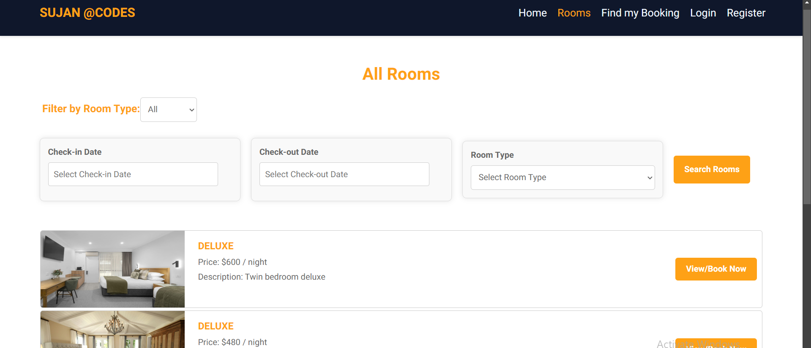
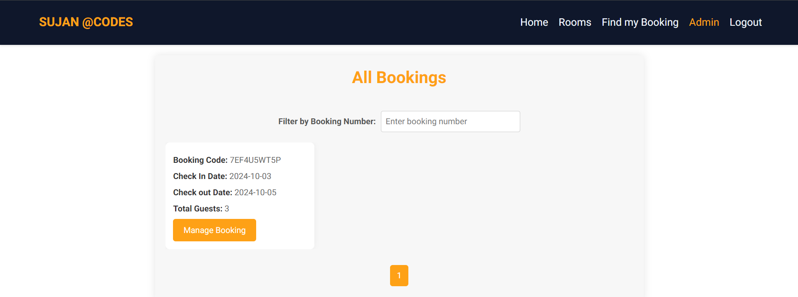

# Advanced Hotel Booking App with Kafka Integration

This project is a full-stack web application built using Spring Boot for the backend and React for the frontend. It aims to provide users with a seamless hotel booking experience, while offering advanced features like real-time room availability, dynamic pricing, and Kafka-based real-time updates.

## Features

- User registration and login (JWT authentication).
- Browse and search for available rooms.
- Admin panel for managing rooms, bookings, and users.
- Real-time notifications and updates
- Saved Images in Cloudinary

## Future Updates in Coming days

- Real-time room availability (Kafka integration).
- Book rooms with payment integration.
- Dynamic pricing algorithm for rooms.
- Analytics dashboard for hotel administrators.

## Technologies Used

### Backend (Spring Boot)

- Java 17+
- Spring Boot
- Spring Security (JWT)
- Spring Data JPA (Hibernate)
- Apache Kafka (Real-time updates) \*\* in process
- MySQL Database
- REST API
- Maven
- Cloudinary for object image storage

### Frontend (React)

- React.js
- Axios (for API calls)
- Redux (state management)
- Tailwind CSS (for styling)
- React Router (for navigation)

## Getting Started

### Prerequisites

#### Backend

- Java 17+
- Maven
- MySQL

#### Frontend

- Node.js
- NPM or Yarn
